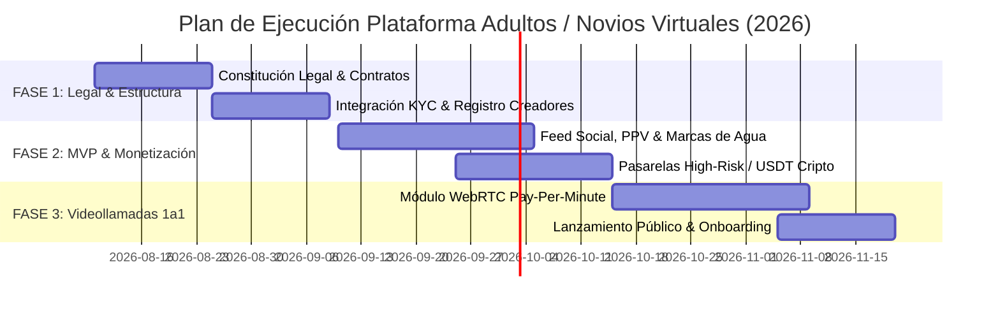

# INFORME LEGAL, TÉCNICO Y ESTRATÉGICO INTEGRAL
## Desarrollo de Plataforma Web de Contenido para Adultos, Suscripciones y Acompañamiento Virtual 1a1 (Novios/as Virtuales)

---

### 📌 DATOS DEL DOCUMENTO
* **Destinatario:** Cliente / Equipo Directivo
* **Ámbito Geográfico & Normativo:** Argentina (Nacional) e Internacional (EE.UU. / Unión Europea / LATAM)
* **Estado:** Documento Técnico-Legal Ejecutivo Confidencial
* **Fecha de Actualización:** Agosto 2026

---

## 1. RESUMEN EJECUTIVO Y ALCANCE DEL PROYECTO

El presente informe establece las bases operativas, jurídicas, financieras y tecnológicas para el diseño y lanzamiento de una plataforma web (PWA - Progressive Web App) tipo red social de economía de creadores. La propuesta se inspira en modelos exitosos como *OnlyFans*, *Fansly* y *Cafecito*, expandiendo sus posibilidades hacia el **acompañamiento virtual casual y citas 1 a 1** (*novios/as virtuales*).

### Módulos Principales de Monetización:
1. **Suscripciones Mensuales por Niveles (Tiered Subscriptions):** Acceso a feeds de publicaciones, fotos y videos exclusivos mediante un plan mensual recurrente ($5 a $50 USDT/mes).
2. **Contenido Unlockable / Pay-Per-View (PPV):** Venta individual de sets fotográficos, videos premium o mensajes privados bloqueados.
3. **Citas Virtuales 1a1 y Novios/as Virtuales (WebRTC):** Videollamadas privadas en tiempo real tarifadas por minuto (*Pay-Per-Minute*), chats de voz y acompañamiento virtual casual.
4. **Propinas y Mensajería Prioritaria:** Posibilidad de enviar propinas, mensajes directos prioritarios y solicitudes de contenido personalizado.

> [!IMPORTANT]
> **Principio General de Operación:** La plataforma está abierta a todas las expresiones e identidades (mujeres, hombres, colectivo LGBTQ+) bajo la premisa innegociable de operar **100% dentro del marco legal vigente**, sin excepciones.

---

## 2. MARCO LEGAL Y REGULATORIO (ARGENTINA)

Para operar de forma legítima desde o hacia la República Argentina, la plataforma debe integrar en su código y en sus procesos operativos los siguientes pilares normativos:

### A. Ley Olimpia (Ley 27.736 - Violencia Digital)
* Modifica la Ley 26.485 para tipificar la **violencia digital** como una modalidad de violencia de género.
* **Obligación de la Plataforma:** Debe incorporar un sistema explícito y expedito de reclamos (*Notice and Takedown*) que permita ordenar la **baja inmediata en un plazo máximo de 24 horas** de cualquier contenido difundido sin consentimiento expreso.

### B. Ley de Protección de Datos Personales (Ley 25.326)
* La información sobre la vida sexual, preferencias o participación en plataformas de adultos reviste el carácter legal de **Dato Sensible**.
* **Obligaciones:**
  1. Exigir consentimiento libre, expreso e informado mediante firma digital o aceptación de términos.
  2. Registrar las bases de datos ante la Agencia de Acceso a la Información Pública (AAIP).
  3. Implementar cifrado de punta a punta (E2EE) en datos personales y transacciones.

### C. Código Penal de la Nación (Art. 128 / Art. 125 bis)
* Tolerancia cero frente a material de abuso sexual infantil (CSAM), coerción, facilitación o trata de personas.
* **Obligación:** Implementación automatizada de firmas digitales hash (PhotoDNA / NCMEC) para auditoría de archivos subidos y reporte inmediato a autoridades judiciales ante cualquier vulneración.

### D. Derechos de Autor y Cesión de Imagen (Ley 11.723)
* Los creadores conservan la propiedad intelectual absoluta de sus contenidos.
* La plataforma opera mediante un **Contrato de Licencia de Uso No Exclusiva y Revocable**, regulado en los Términos y Condiciones aceptados al momento del registro.

### E. Aspectos Impositivos y Bancarios (ARCA / AFIP)
* **Encuadre para Creadores Locales:** Facturación bajo el régimen de **Monotributo (Exportación de Servicios)** o Responsable Inscripto.
* **Servicios de la Plataforma:** Emisión de resúmenes de retención/comisión de plataforma para respaldar legalmente el ingreso de divisas.

---

## 3. MARCO LEGAL INTERNACIONAL

Si la plataforma permite el registro o cobro a clientes fuera de Argentina (EE.UU., Europa, LATAM), debe cumplir con los estándares internacionales exigidos por las redes de procesamiento:

### A. US 18 U.S.C. § 2257 (Registro de Intérpretes)
Exige a los operadores mantener bajo custodia durante al menos 7 años:
1. Copia del documento de identidad oficial vigente (DNI/Pasaporte) de cada modelo.
2. Comprobante de edad confirmada (mayor de 18 años).
3. Nombres artísticos o pseudónimos utilizados.
4. Fechas exactas de producción y publicación del contenido.

### B. Mastercard Revised Standards (AN 4480 / GLB 13267) & Visa Adult Rules
* **Verificación Biométrica Obligatoria:** Prohibición estricta de simples casillas o botones de "Soy mayor de 18". Se exige verificación documental/biométrica.
* **Pre-moderación de Contenidos:** Revisión previa o automatizada mediante IA de los archivos subidos.
* **Prohibición de Contenido Sintético / Deepfakes:** Prohibición absoluta de comercializar imágenes/videos alterados por IA de personas reales sin su autorización previa firmada.

### C. Unión Europea (DSA & GDPR) y UK Online Safety Act
* Exigen mecanismos de *Age Assurance* (aseguramiento efectivo de edad) y canales transparentes de reporte y moderación comunitaria.

---

## 4. SISTEMA DE VERIFICACIÓN KYC Y EDAD (AGE ASSURANCE)

Se implementará un motor de verificación en dos capas:

| Rol de Usuario | Requisitos de Verificación | Tecnología Integrada |
| :--- | :--- | :--- |
| **Creador / Modelo** | **KYC Completo:** Carga de DNI/Pasaporte (frente y dorso) + Selfie Biométrica (*Liveness Detection*) + Firma Digital Formulario 2257 y Ley Olimpia. | Sumsub / Veriff / Persona SDK |
| **Cliente / Comprador** | **Age Assurance:** Verificación de mayoría de edad (18+) mediante tarjeta de crédito válida o validación biométrica básica. | Yoti / Pasarela de Pago |

---

## 5. ARQUITECTURA FINANCIERA Y PASARELAS DE PAGO

> [!CAUTION]
> **PROHIBICIÓN ESTRICTA EN MERCADO PAGO, STRIPE Y PAYPAL:**
> Mercado Pago, Stripe y PayPal prohíben explícitamente en sus Términos y Condiciones los negocios vinculados a contenido para adultos, prostitución o acompañamiento erótico. Intentar procesar cobros por estas vías provocará la **congelación de fondos e inhabilitación definitiva** de las cuentas.

### Soluciones de Cobro Aprobadas (High-Risk & Cripto):

1. **Pasarelas de Alto Riesgo (High-Risk Merchant Accounts):**
   * **CCBill / Segpay / Epoch:** Procesadores internacionales autorizados por Visa/Mastercard para la industria de adultos.
   * **Discreción Bancaria:** El cargo en el resumen bancario del cliente figurará bajo una razón social neutra (ej. *SERVICES INTERACTIVE DIG 800-555*).
2. **Criptomonedas (USDT TRC20 / BEP20 / Binance Pay):**
   * Método recomendado por su inmediatez, privacidad y ausencia de fricciones cambiarias.
   * Permite acreditación instantánea de créditos en la plataforma tanto para cobro a clientes como para retiro de fondos por parte de los creadores.
3. **Liquidación a Modelos:**
   * Transferencias a monederos de la industria (**Paxum**, **Cosmo Payment**) o liquidación directa vía USDT / P2P.

---

## 6. SEGURIDAD TÉCNICA Y PROTECCIÓN ANTI-FILTRACIONES

1. **Marcas de Agua Dinámicas e Invisibles:**
   * Cada imagen o video visualizado en la plataforma incluye un overlay dinámico con el ID único del comprador (`USER #ARG-84920`) y fecha/hora. En caso de filtración, la fuente es identificable inmediatamente.
2. **Protección en Navegador (PWA / Canvas):**
   * Deshabilitación de descargas directas y bloqueo de atajos de captura de pantalla en dispositivos móviles.
3. **Moderación con Inteligencia Artificial:**
   * Filtro automatizado mediante Hive AI para detectar y bloquear material no consentido o violatorio antes de su publicación.

---

## 7. PLAN DE ACCIÓN PASO A PASO (HOJA DE RUTA)

### FASES DE EJECUCIÓN:

* **Fase 1: Cimientos Legales y Estructura (Semanas 1 - 3):**
  * Redacción de Términos y Condiciones, Política de Privacidad (Ley 25.326/GDPR), Acuerdo de Creador y Formulario 2257.
  * Elección de jurisdicción para la entidad comercial (ej. LLC en EE.UU. / Uruguay o SRL en Argentina) necesaria para pasarelas de alto riesgo.
  * Configuración del canal de verificación KYC (Sumsub/Veriff).

* **Fase 2: Desarrollo MVP y Monetización (Semanas 4 - 8):**
  * Desarrollo de la Web App Responsive / PWA.
  * Feed social de creadores, sistema de suscripciones y venta de contenido PPV.
  * Inserción de marcas de agua dinámicas e integración de pagos en USDT y CCBill.

* **Fase 3: Novios/as Virtuales & Escala (Semanas 9 - 12):**
  * Desarrollo del módulo de videollamadas WebRTC 1 a 1 con tarificación por minuto (*Pay-Per-Minute*).
  * Onboarding de creadores y campaña oficial de lanzamiento.

---

### 📄 ARCHIVOS ADJUNTOS EN EL PROYECTO
1. **Documento PDF Oficial:** `Informe_Legal_y_Tecnico_Plataforma_Adultos.pdf` (Formato ejecutivo listo para enviar al cliente).
2. **Prototipo Web Funcional:** Ejecutándose localmente en `http://localhost:5173/`.
